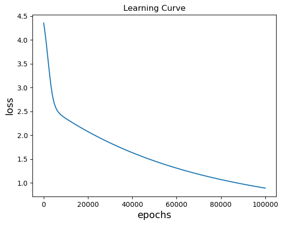

# DLP2023 Lab1 Report
###### tags : `DLP`
## I. Introduction
In this lab, we need to implement a MLP from scratch to make predictions on linear data/ XOR data.
##### linear data

##### XOR data

## II. Experiment setups
#### Sigmoid functions
we use sigmoid functions as activation function for Bernoulli output distribitions:

    sigmoid(x) = 1/(1 + np.exp(-x)),
    # where x is an input vector
#### Neural Network
I construct my Neural Network as an 4 layers MLP, including:
* 1 input layer with 2 neurons
* 2 hideen layers with 5 neurons
* 1 output layer with 1 neuron
#### Backpropagation
To implement backpropagation, I follwed the chain rule and use SGD to reduce the loss between the ground truth and predictions.


## III. Result of our testing
In this experimant, I use the MLP structure as below, 

```
self.input_size = 2
self.hidden1_size = 5
self.hidden2_size = 5
self.output_size = 1

self.bias1 = 0.001
self.bias2 = 0.001
self.bias3 = 0.001

self.learning_rate = 0.0001

# MLP Structure
self.hidden1_output = self.sigmoid(np.dot(x, self.weights1) + self.bias1)

self.hidden2_output = self.sigmoid(np.dot(self.hidden1_output, self.weights2) + self.bias2)

self.y = self.sigmoid(np.dot(self.hidden2_output, self.weights3) + self.bias3)

```


#### Screenshot and comparison figure
* linear data
```
########## Training ##########
epoch: 0 loss: 19.707828308597794
epoch: 5000 loss: 11.703395167274369
epoch: 10000 loss: 10.986526018601785
epoch: 15000 loss: 10.304332547103655
epoch: 20000 loss: 9.64612549801238
epoch: 25000 loss: 8.99090758326567
epoch: 30000 loss: 8.28916103818994
epoch: 35000 loss: 7.4110205924291765
epoch: 40000 loss: 6.0481474120614545
epoch: 45000 loss: 4.036643998811939
epoch: 50000 loss: 2.2979547658990476
epoch: 55000 loss: 1.3228315975599765
epoch: 60000 loss: 0.8181628517864188
epoch: 65000 loss: 0.5463036030240604
epoch: 70000 loss: 0.3901731526396414
epoch: 75000 loss: 0.2943131473514693
epoch: 80000 loss: 0.23176056424684358
epoch: 85000 loss: 0.18875499496380768
epoch: 90000 loss: 0.15787016504044124
epoch: 95000 loss: 0.13487228189637127
epoch: 100000 loss: 0.1172235081373543
```
* XOR data
```
########## Training ##########
epoch: 0 loss: 4.354038461093501
epoch: 5000 loss: 2.6329401797784695
epoch: 10000 loss: 2.3505296574955077
epoch: 15000 loss: 2.2069506471561886
epoch: 20000 loss: 2.0745607619347566
epoch: 25000 loss: 1.9514920697245999
epoch: 30000 loss: 1.8372667747531213
epoch: 35000 loss: 1.731375803239726
epoch: 40000 loss: 1.6332882005526335
epoch: 45000 loss: 1.5424680904081427
epoch: 50000 loss: 1.458387485312334
epoch: 55000 loss: 1.380535545683674
epoch: 60000 loss: 1.308424918583932
epoch: 65000 loss: 1.241595744289864
epoch: 70000 loss: 1.1796178540413402
epoch: 75000 loss: 1.1220916057141206
epoch: 80000 loss: 1.0686477261065501
epoch: 85000 loss: 1.0189464555532197
epoch: 90000 loss: 0.9726762261482007
epoch: 95000 loss: 0.9295520502772051
epoch: 100000 loss: 0.8893137513616681
```
#### Accuracy of predictions
* linear data
```
########## Testing ##########
[[0.04885185]
 [0.99026438]
 [0.04591891]
 [0.97382463]
 [0.98144294]
 [0.04908157]
 [0.91623558]
 [0.9922173 ]
 [0.93949897]
 [0.05966693]
 [0.06115725]
 [0.95562733]
 [0.04392331]
 [0.05955784]
 [0.97334494]
 [0.99087272]
 [0.04308378]
 [0.04729249]
 [0.98872807]
 [0.98092322]
 [0.05138492]
 [0.99032675]
 [0.05143008]
 [0.92530007]
 [0.9927092 ]
 [0.06572075]
 [0.93626302]
 [0.98655311]
 [0.05662073]
 [0.04809556]
 [0.04347578]
 [0.04542001]
 [0.05114824]
 [0.04517691]
 [0.9909118 ]
 [0.95021669]
 [0.99130848]
 [0.07021756]
 [0.97956655]
 [0.98555572]
 [0.91391313]
 [0.04799038]
 [0.04672116]
 [0.9692424 ]
 [0.04506585]
 [0.05546243]
 [0.92689614]
 [0.94584002]
 [0.98578389]
 [0.97853978]
 [0.06632697]
 [0.04874946]
 [0.06568407]
 [0.05978849]
 [0.06058353]
 [0.93042663]
 [0.99004742]
 [0.95350351]
 [0.96492214]
 [0.9919948 ]
 [0.06547457]
 [0.04405856]
 [0.98888061]
 [0.94564281]
 [0.9347265 ]
 [0.97760179]
 [0.96791502]
 [0.99205101]
 [0.92425526]
 [0.05680082]
 [0.99084814]
 [0.05216714]
 [0.91791988]
 [0.99212406]
 [0.98864012]
 [0.98888702]
 [0.92288089]
 [0.04774694]
 [0.95286058]
 [0.06774614]
 [0.04742177]
 [0.91822982]
 [0.06947943]
 [0.94577541]
 [0.95711463]
 [0.94886957]
 [0.97136569]
 [0.93500877]
 [0.98245779]
 [0.04806767]
 [0.04397582]
 [0.04319297]
 [0.05994318]
 [0.058049  ]
 [0.98268983]
 [0.04308434]
 [0.97341871]
 [0.04393532]
 [0.99202863]
 [0.91890971]]
accuracy:  1.0
```


* XOR data
```
########## Testing ##########
[[0.28146555]
 [0.70094088]
 [0.28180131]
 [0.70079806]
 [0.28212641]
 [0.70065652]
 [0.282435  ]
 [0.70051635]
 [0.28272231]
 [0.70037763]
 [0.28298481]
 [0.28322035]
 [0.70010485]
 [0.283428  ]
 [0.69997092]
 [0.28360797]
 [0.69983872]
 [0.2837613 ]
 [0.69970831]
 [0.28388967]
 [0.69957972]]
accuracy:  1.0

```

#### Leraning curve
* linear data


* XOR data


  
#### others
## IV. Discussion
#### different learning rate

*The accuracy after training by this two MLP will be both 1.0*

* linear data


* XOR data


#### different numbers of hidden units
*The accuracy after training by this two MLP will be both 1.0*
* linear data


* XOR data


#### without activation functions
*The accuracy after training by this two MLP will be both 1.0*

* linear data


* XOR data


#### others
## V. Extra
#### Implementation of momemtum optimizer
Sometimes, I found that using SGD optimizer will turn our to be in the local minimum. So I implement momemtum optimizer to solve this problem.

```
V(t) = beta * V(t-1) - learning_rate * gradient

Weight = Weight + V(t)
```
* linear data


* XOR data


#### ReLU
Implement relu and its derivatives for back propagations.
```
def ReLU(self, x):
        return np.maximum(0, x)
    
def ReLU_derivatives(self, x):
    return 1 * (x > 0)
```
* linear data


* XOR data


#### 
---
## Reference
https://machinelearningmastery.com/implement-backpropagation-algorithm-scratch-python/

https://rubikscode.net/wp-content/uploads/2021/04/Momentum-Optimizer-Ultimate-Guide-to-Machine-Learning-with-Python.pdf

https://stackoverflow.com/questions/32546020/neural-network-backpropagation-with-relu


https://stackoverflow.com/questions/3775032/how-to-update-the-bias-in-neural-network-backpropagation