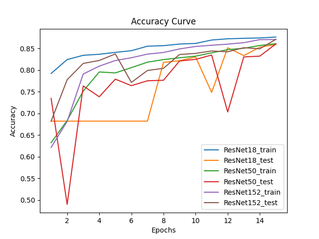

# DLP Lab3
### Comparison Figure


### Training
```
python main.py --ResnetModel {18, 50, 152} --mode train --epochs 40 --batch_size 128 --learning-rate 0.128
```
### Testing
```
python main.py --mode test --ResnetModel {18, 50, 152} --model-weight-path {path_to_your_weight}
```