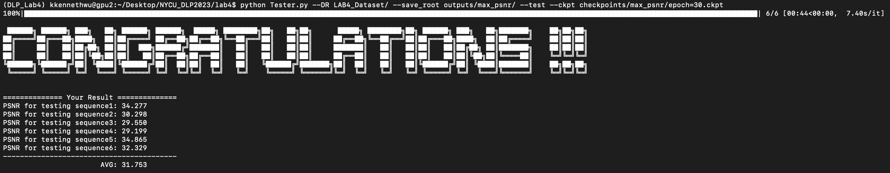

# DLP Lab4 - CVAE Video Predictor
## Environments
```
conda create --name DLP_Lab4 python=3.9
conda activate DLP_Lab4
pip install -r requirements.txt
```

## Highest PSNR
##### training
```
python Trainer.py --DR LAB4_Dataset/ --save_root checkpoints/max_psnr/ --num_epoch 100 --fast_train --fast_train_epoch 6 --kl_anneal_type NoKL_Annealing --tfr 0 
```
##### validation 
```
python Trainer.py --DR LAB4_Dataset/ --save_root checkpoints/max_psnr/ --test --ckpt checkpoints/max_psnr/epoch=36.ckpt
```
##### testing
```
python Tester.py --DR LAB4_Dataset/ --save_root outputs/max_psnr/ --test --ckpt checkpoints/max_psnr/epoch=36.ckpt
```
##### results

