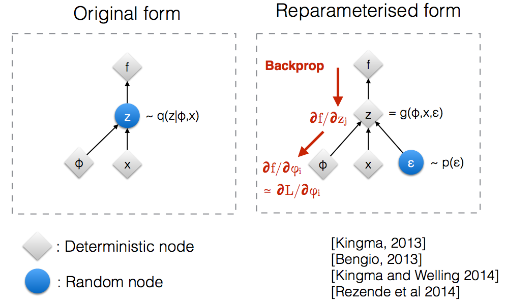
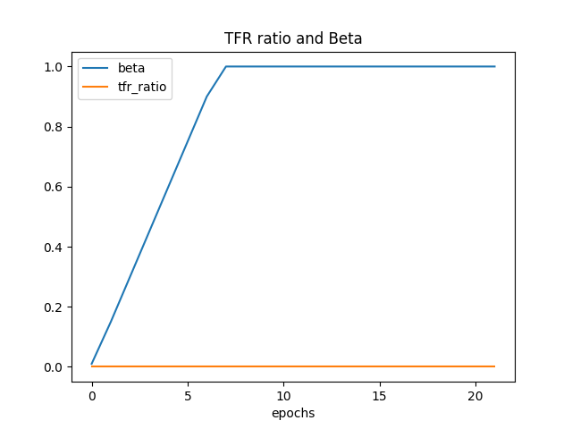
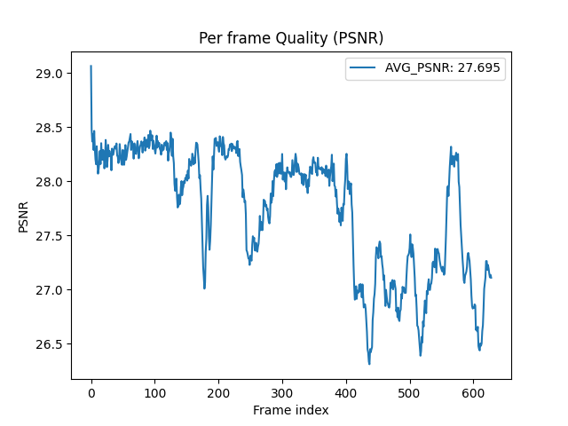
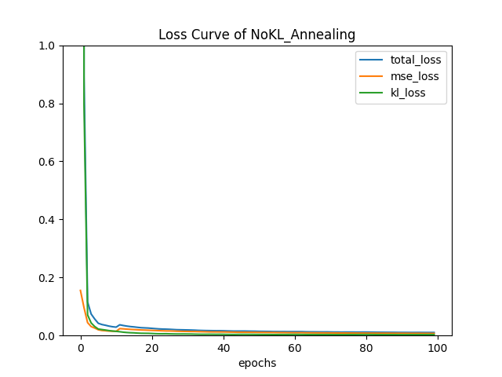
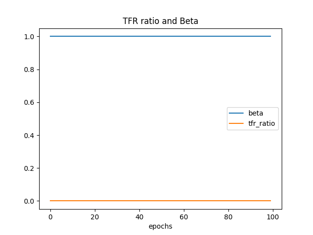
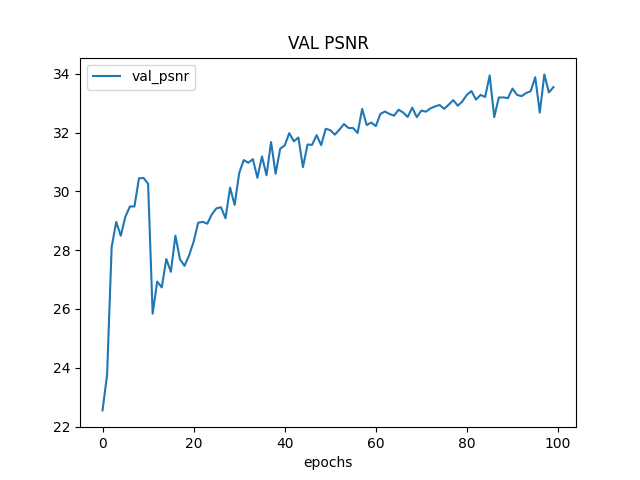
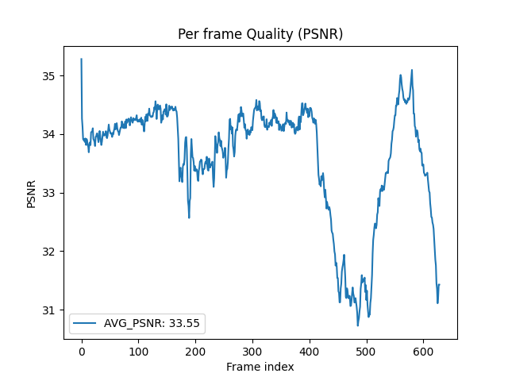

# DLP2023 Lab4 Report
## Introduction
In this lab, we are going to implement a conditional vidoe prediction with  ***Conditional Variational Auto Encoder (CVAE)*** . With a given frame, and a sequence of poses, we want our model able to generate video sequence that the person in the frame doing the similar pose as the the given poses. 

Therefore, in training step, we input a sequence of video and correponding frame to make our model learn the how to generate the next frame. And because the model need to generate a continous sequence video, we use ***Variational Auto Encoder*** instead of ***Auto Encoder***, where VAE will add a noise to the model, which make VAE able to generate a distribution instead of discrete variables.

## Implementation Details
### Training protocol
#### I. Coarse version of training
In training protocol, there will 16 frames as a training video sequence, and 16 corresponding pose as conditional labels. Starting from the first frame (***current_frame***) and the second label (***next_pose***), we want the model learn that the frame distribution from the first frame but with the second pose. So first, we sent current_frame and next_pose to two encoders seperately, and get ***encoded_current_frame*** and ***encoded_next_pose***. 
```
encoded_current_frame = self.frame_transformation(current_frame)
encoded_next_pose = self.label_transformation(next_pose)
```

Second, we sent encoded_current_frame, encoded_next_pose, and a param(***z***), which I will explain later, to a decoder, and get ***decoded_features***. Then we sent the decoded_features to the generator to generate the ***predicted_next_frame***.
```
decoded_features = self.Decoder_Fusion(encoded_current_frame, encoded_next_pose, z)
predicted_next_frame = self.Generator(decoded_features)
```

So, we get the ***predicted next frame*** generated by the model. Similarly, use the generated frame(***predicted next frame***) and the third pose as the new inputs to train the model, and so on. 

#### II. Loss
To train the model, there are two losses to calculate the gradients:

The first one is ***MSE loss (Reconstruction loss)*** , which equals to calculate the MSE loss of ***predicted next frame*** and ***ground truth next frame***. 
```
mse_loss += self.mse_criterion(predicted_next_frame, next_frame)
```

The second one is ***KL Divergence***, which wants the latent distribution the encoder learned is as close as prior distribtion. We get the KL Divergence by sending next_pose and next_frame to two encoders sperately, and get ***encoded_next_pose*** and ***encoded_next_frame***. Then, send them to a posterior predictor to get the ***mean*** and ***log variance***. And use mean and variance to calculate the KL Divergence. 
```
encoded_next_frame = self.frame_transformation(next_frame)
encoded_next_pose = self.label_transformation(next_pose)
z, mu, logvar = self.Gaussian_Predictor(encoded_next_frame, encoded_next_pose) # z from reparameterization trick     
kl_loss += kl_criterion(mu, logvar, self.batch_size)   
```
And we get our final loss, where beta is the ratio from kl_annealing:
```
beta = self.kl_annealing.get_beta()
loss = mse_loss + beta * kl_loss
```
for each batch, I use the loss to compute the gradient, then clean up the gradients.
```
loss.backward()
self.optimizer_step()
self.optim.zero_grad()
```
### Reparametrization tricks
Let's explain the param z. We calculate z by mean, standard deviation from posterior predictor, and a normal distribtion.
```
std = torch.exp(0.5 * logvar)
epsilon = torch.randn_like(std)
z = mu + std * epsilon
```
And why we need to do this parameteriztion trick? Originally, the latent variables takes sample from mean, and log variance. and we feeds this samples to the decoder. But the problem is we cannot run back propagation through a smapled latent variable. So, to train the model end-to-end, we represent the latent variables as: `z = mu + std * epsilon`, where epsilon is a normal distribution. So now, we dont have a whole stochastic latent variables, the only stochastic part is the epsilon, and we don't need to run backpropagation through it. 



### Setting of teacher forcing strategy
For different KL Annealing type, I use different teacher forcing strategy.
* Cyclical/Monotonic KL Annealing
I set the teacher forcing ratio starting at 1, and start decaying when epoch meet sde, and gradually decay to 0 at the end of training. Without this strategy, I found taht the loss will be ***nan*** at first, becuase we don't have KL loss at first (beta=0). And this will make our model training failed.

* No KL Annealing
In all training stage, I set the teacher forcing ratio = 0. This setting will make the validation/testing PSNR over 27 with just 6 epoch.

### KL annealing ratio
My best val/test PSNR can meet 30 at just 4 epoch, when I don't use KL Annealoing i.e KL Annealing ratio equal to 1 all the training stage, and without teacher forcing strategy, and --fast-train. I thought the reason why this training strategy will get great score is that the encoder may learn the prior distribtion early and I also use --fast train.


Because the model will converge earlier with 

And because of --fast-train, when the model start training with whole training data, the PSNR will decrease. But gradually, the PSNR will back to 30 at epoch 17, and keep increasing.
## Analysis & Discussion
After a plenty of experiments, I found that the ratio of ***tfr ratio*** and ***beta*** plays a great role in training model. The tfr ratio and beta both represent the information from groundtruth label, because the tfr ratio represent how many the groundtruth frame feeding to the generator model, and the beta represent how much information from prior distribution adding to the loss. So, it can be thought that we cannot add to many ground truth information to the model. We also need to add some bad information (from predicted_next_frame mentioned before).

### Plot teacher forcing ratio
Here I use kl anneal type cyclical to experiment. I inital the beta=0.01 to make sure there are some KL loss for bad information at first. Otherwise, if the beta starting at 0, we will meet the gradient vanishing problem, and the loss will be nan. This will cause the model to fail to be trained for all subsequent epochs. Also, I use `--fast_tain` in the whole training stage to acclerate training, i.e just training with partial training data. And I use `--batch-size=4` to accelerate training, which will make the performance a little bit worse compared to `--batch_size=2`

* [Case A] tfr = 0
    ```
    python Trainer.py --DR LAB4_Dataset/ --save_root checkpoints/tfr_compare_tfr0_Cyclical --tfr 0 --tfr_sde 5 --kl_anneal_type Cyclical --kl_anneal_ratio 1.5 --num_epoch 22 --fast_train --fast_train_epoch 22 --batch_size 4
    ```

    

    
    
    

* [CASE B] tfr = 1, and start decaying at epoch 5
    ```
    python Trainer.py --DR LAB4_Dataset/ --save_root checkpoints/tfr_compare_tfr1_Cyclical --tfr 1 --tfr_sde 5 --kl_anneal_type Cyclical --kl_anneal_ratio 1.5 --num_epoch 22 --fast_train --fast_train_epoch 22  --batch_size 4
    ```
    

    
    
    

We can see that the [CASE A] has better performance becuase we feed good information and bad information to the model. On the other hand, [CASE B] have too grountruth information at begining, causing the bad performance.

### Plot loss curve while training with different setting
I test the performance of different kl anneal type with tfr=0. Also, I use `--fast_tain` in the whole training stage to acclerate training, i.e just training with partial training data. And I use `--batch-size=4` to accelerate training, which will make the performance a little bit worse compared to `--batch_size=2`

* With KL annealing (Monotonic), beta starting from 0.01
    ```
    python Trainer.py --DR LAB4_Dataset/ --save_root checkpoints/KL_compare_tfr0_Monotonic --tfr 0 --tfr_sde 5 --kl_anneal_type Monotonic --kl_anneal_ratio 1.5 --num_epoch 22 --fast_train --fast_train_epoch 22 --batch_size 4
    ```
    
    
    
    
    
    
    

* With KL annealing (Cyclical), beta startin from 0.01
    ```
    python Trainer.py --DR LAB4_Dataset/ --save_root checkpoints/tfr_compare_tfr0_Cyclical --tfr 0 --tfr_sde 5 --kl_anneal_type Cyclical --kl_anneal_ratio 1.5 --num_epoch 22 --fast_train --fast_train_epoch 22 --batch_size 4
    ```
    
    
    
    
    
    
    

* Without KL annealing, beta = 1
    ```
    python Trainer.py --DR LAB4_Dataset/ --save_root checkpoints/KL_compare_tfr0_NoKL --tfr 0 --tfr_sde 5 --kl_anneal_type NoKL_Annealing --kl_anneal_ratio 1.5 --num_epoch 22 --fast_train --fast_train_epoch 22 --batch_size 4
    ```
    
    
    
    
    
    
    

For these three type of KL annealing, we starting from a similar validation PSNR because we both have a good portion of ground truth informations and bad informations. And we can see that the validation psnr will be not that smooth as the teacher forcing ratio will keep changing. They both reach a similar validation psnr. I thought the reason why they dont differ too much is the propotion of ground truth information and bad information is already good, so they can both reach a greate performance. So actually, I thought that the key role on the model performance is not what type of KL annealing we used, is that the propotion of groundtruth informations and bad informations we feed the model.

### PSNR-per frame diagram in validation dataset
With 21 epoch and tfr = 0:
* With KL annealing (Monotonic), beta starting from 0.01
    
    

* With KL annealing (Cyclical), beta startin from 0.01
    
    

* Without KL annealing, beta = 1
    
    

### Derivate conditional VAE formula (extra points 5%)


## Highest PSNR
#### training
```
python Trainer.py --DR LAB4_Dataset/ --save_root checkpoints/max_psnr/ --num_epoch 100 --fast_train --fast_train_epoch 9 --kl_anneal_type NoKL_Annealing --tfr 0 
```







#### validation 
```
python Trainer.py --DR LAB4_Dataset/ --save_root checkpoints/max_psnr/ --test --ckpt checkpoints/max_psnr/epoch=99.ckpt
```



#### testing
```
python Tester.py --DR LAB4_Dataset/ --save_root outputs/max_psnr/ --test --ckpt checkpoints/max_psnr/epoch=99.ckpt
```


## Reference
https://www.youtube.com/watch?v=9zKuYvjFFS8&t=6s&ab_channel=ArxivInsights

https://medium.com/mlearning-ai/a-must-have-training-trick-for-vae-variational-autoencoder-d28ff53b0023

https://www.youtube.com/watch?v=8zomhgKrsmQ&ab_channel=Hung-yiLee
