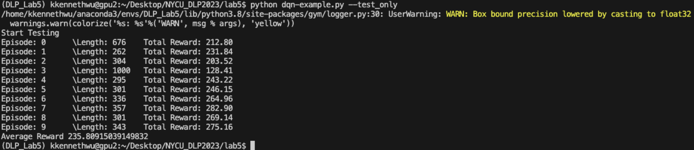
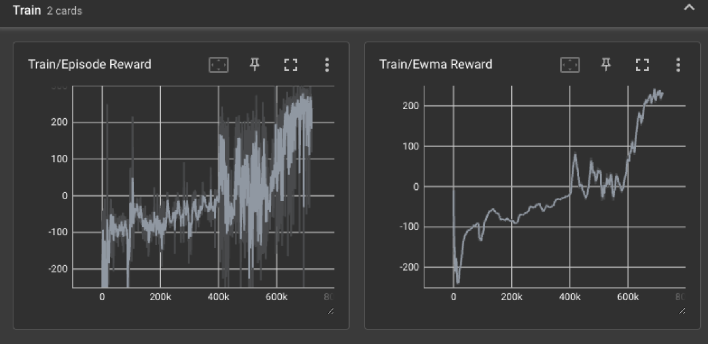
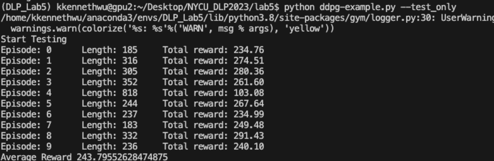
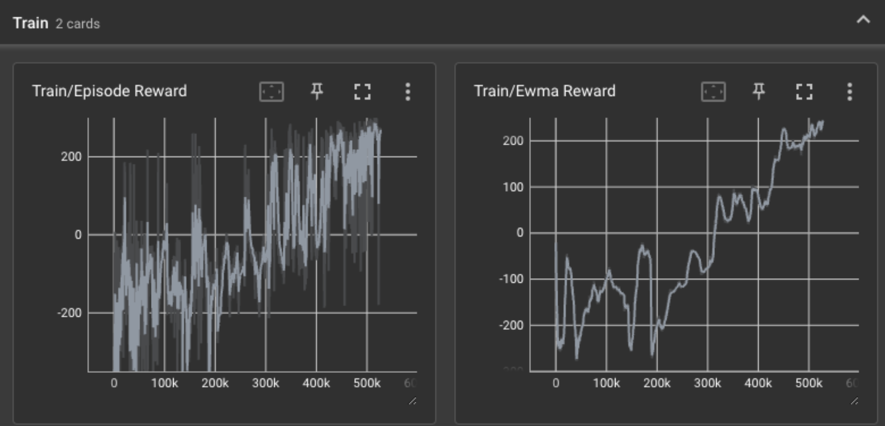
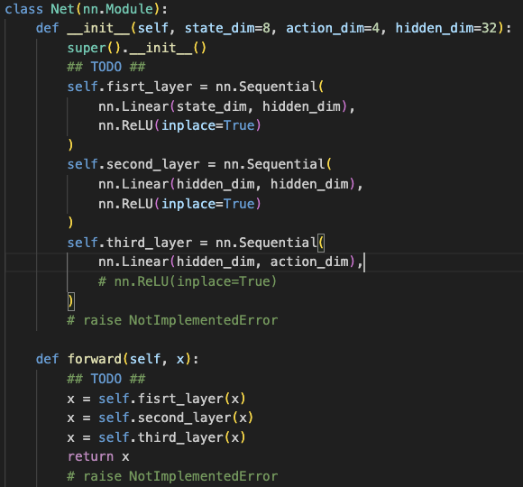
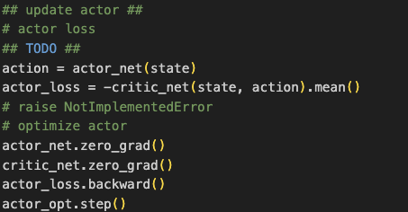
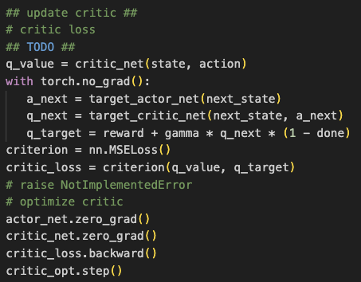

## Experimental Results (100%)
### LunarLander-v2 using DQN

### LunarLander-v2 using DDPG

### LunarLander-v2 using DQN

## Questions (bonus 10%)
* (5%) Describe your major implementation of both DQN and DDPG in detail. Your description should at least contain three parts:
    1. Your implementation of Q network updating in DQN.
        
        Implement Q-Network with 2 fully connected layer with RelU and 1 fully connected layer at the end. 

        
    
    2. Your implementation and the gradient of actor updating in DDPG.

        Compute the actor_loss use following formula, which we feed state and action to the critic_net, and get the negative mean value of it. Use the loss to update actor net.

        

    3. Your implementation and the gradient of critic updating in DDPG.
        
        Compute the mse loss of q_value and q_target, and use the loss to compute the gradients, and update the critic network.

        

* (1%) Explain effects of the discount factor.
 
    In Q-learning, the discount factor means that the agent focus on current reward whrn it's small, while the agent will focus on future reward when it's larger.

* (1%) Explain benefits of epsilon-greedy in comparison to greedy action selection.
 
    It means that the agent will select action from random sanple action space, not just always choose the best action for current state because the best action for now may mot be the best action in the future. 

* (1%) Explain the necessity of the target network.

    The target network because it provides a stable reference for estimating Q-values and to address the moving target problem inherent in training neural networks through reinforcement learning. By using the target network to estimate Q-values, the primary network can learn in a more stable manner, avoiding the challenges of the moving target problem during direct training.

* (2%) Describe the tricks you used in Breakout and their effects, and how they differ from those used in LunarLander

    * I speed up the decreasing of epsilon, this made the model converge faster. 
    * Use a stack of frame as input to the net work for continuos ball movement.
    * Use clipReward to make reward just binary.
    * Use episodicLife because or Qbert sometimes we stay in lives == 0 condtion for a few frames so its important to keep lives > 0, so that we only reset once.