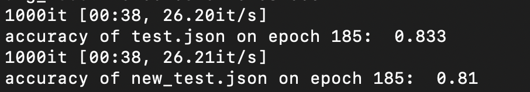
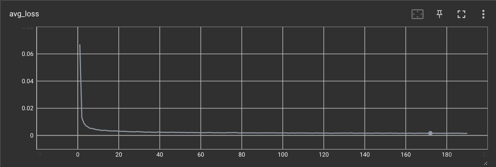
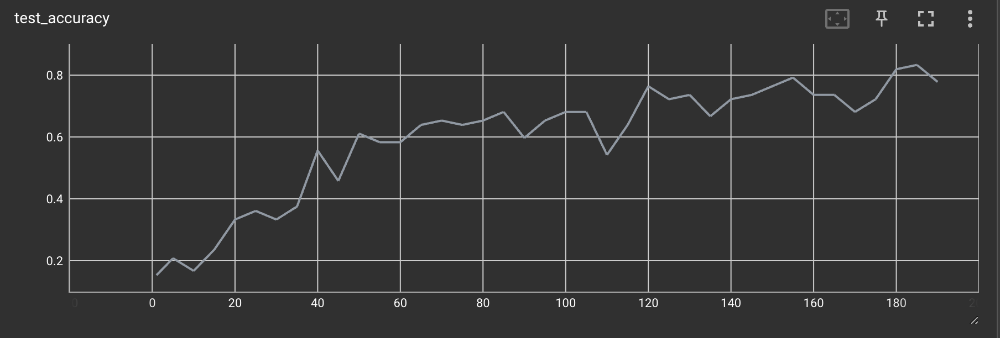
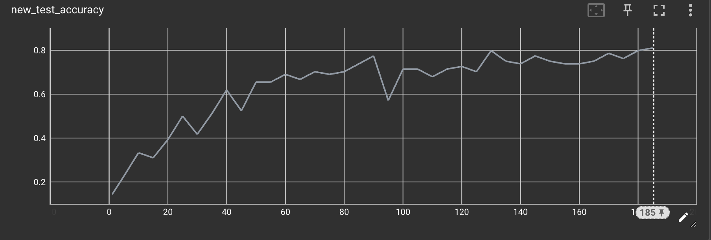
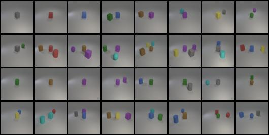
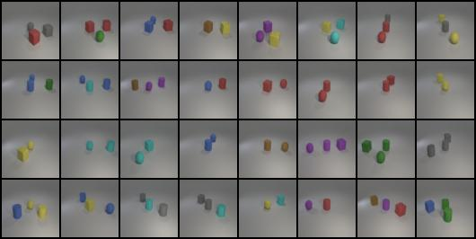
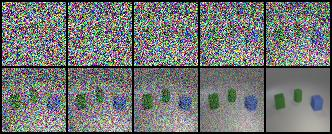

# DLP_Lab6 Report
## Report (50%)
### Introduction (5%)
In this lab, we need to implement a conditional DDPM to generate synthetic images given some text, such as "red cube", "yellow sephere".

### Implementation details (20%)
#### - Describe how you implement your model, including your choice of DDPM, UNet architectures, noise schedule, and loss functions. (15%)
* DDPM:

    I use from ***diffuser library*** to implement conditional DDPM. Below is the main idea. For each img and condition, I use ***noise_scheduler*** from diffuser library to add a random noise to the img, then use the ***noise_predicter***, which is an ***Unet*** to predict the noise we add. Then, calculate the loss with the noise we just randomed. Finally, do backpropagation to fine tune the DDPM.
    ```
        # in each training step
        for x, y in tqdm(self.train_dataloader):
            x = x.to(self.device)
            y = y.to(self.device)
            noise = torch.randn_like(x)
            timestamp = torch.randint(0, self.num_train_timestamps - 1, (x.shape[0], ), device=self.device).long()
            noise_x = self.noise_scheduler.add_noise(x, noise, timestamp)
            perd_noise = self.noise_predicter(noise_x, timestamp, y)
            
            loss = loss_criterion(perd_noise, noise)
            loss.backward()
            nn.utils.clip_grad_value_(self.noise_predicter.parameters(), 1.0)
            self.optimizer.step()
            self.lr_scheduler.step()
            self.optimizer.zero_grad()
            self.lr = self.lr_scheduler.get_last_lr()[0]
            loss_sum += loss.item()
    ```
* DDPM Scheduler:

    Import DDPM Scheduler from diffuser library, and set number of training timestep to 1000, and the beta scheduler to "squaredcos_cap_v2".
    ```
    self.noise_scheduler = DDPMScheduler(num_train_timesteps=self.num_train_timestamps, beta_schedule="squaredcos_cap_v2")
    ```
* Unet (noise preicter):

    Import UNet2DModel from diffuser library. Because we need to input ***rgb img*** and ***condition*** to Unet, after experiment, I expand the shape of condition to match the shape of rgb img, and concat them. So the actual input channel will 3(rgb) + 24(number of condition). As for time embedding, we can simply send the timestep to the Unet2dModel, and is will do it automatically inside the model.
        
    ```
    class Unet(nn.Module):
        def __init__(self, labels_num=24, embedding_label_size=4) -> None:
            super().__init__()
            self.label_embedding = nn.Embedding(labels_num, embedding_label_size)
            # self.label_embedding = nn.Linear(labels_num, 512)
            # self.timestep_embedding = TimestepEmbedding()
            self.model = UNet2DModel(
                sample_size=64,
                # in_channels=3+labels_num * embedding_label_size,
                in_channels=3 + labels_num,
                out_channels=3,
                time_embedding_type="positional",
                layers_per_block=2,
                block_out_channels=(128, 128, 256, 256, 512, 512),  # the number of output channels for each UNet block
                down_block_types=(
                    "DownBlock2D",  # a regular ResNet downsampling block
                    "DownBlock2D",
                    "DownBlock2D",
                    "DownBlock2D",
                    "AttnDownBlock2D",  # a ResNet downsampling block with spatial self-attention
                    "DownBlock2D",
                ),
                up_block_types=(
                    "UpBlock2D",  # a regular ResNet upsampling block
                    "AttnUpBlock2D",  # a ResNet upsampling block with spatial self-attention
                    "UpBlock2D",
                    "UpBlock2D",
                    "UpBlock2D",
                    "UpBlock2D",
                ),
                # class_embed_type="timestep",
            )
        def forward(self, x, t, label):
            bs, c, w, h = x.shape
            # embeded_label = self.label_embedding(label)
            # embeded_label = embeded_label.view(bs, -1)
            # embeded_label = self.label_embedding(label.to(torch.float))
            # embeded_label = embeded_label.view(bs, embeded_label.shape[1], 1, 1).expand(bs, embeded_label.shape[1], w, h)
            embeded_label = label.view(bs, label.shape[1], 1, 1).expand(bs, label.shape[1], w, h)
            unet_input = torch.cat((x, embeded_label), 1)
            # unet_input = self.label_embedding(unet_input)
            # breakpoint()
            unet_output = self.model(unet_input, t).sample
            return unet_output
    ```
* loss function:

    I simply choose mse loss as loss function.
    ```
    loss_criterion = nn.MSELoss()
    ```

#### - Specify the hyperparameters (learning rate, epochs, etc.) (5%)
```
    lr = 0.0001
    epoch = 1500 # I dont trian till the end
    batch_size = 64
    num_train_timestamps=1000

    optimizer = torch.optim.Adam(self.noise_predicter.parameters(), lr=self.lr)
    lr_scheduler = get_cosine_schedule_with_warmup(
            optimizer=self.optimizer,
            num_warmup_steps=args.lr_warmup_steps,
            num_training_steps=len(self.train_dataloader) * self.epochs,
        )
    lr_warmup_step=0 # for learning sheduler
```

### Results and discussion (25%)
   
#### - Show your accuracy screenshot based on the testing data.  (5%)









#### - Show your synthetic image grids and a progressive generation image. (10%)

* test.json

    

* new_test.json

    

* a progressive generation image

    

#### – Discuss the results of different model architectures or methods. (10%) For example, what is the effect with or without some specific embedding methods, or what kind of prediction type is more effective in this case.

* I've tried to embed the conditional label from dimension=24 to dimension=512, and concat with rgb, but it seems that it is not that fit the model. The result will converge very slowly. 

* At first, I didnt add the leraning rate scheduler to the model, so the learning rate will be a fixed value. this results in that the model cannot learning when epoch increase. Also, there is another intresting thing, if I set the learning rate larger than 1e-4, the model will converge too early, and it will stuck at the local minimum. 

* Instead of meam and variance, the unet model will directly predict noise in my implementation. I thought that directly predict noise will be more effective. Because we can directly calculate the mse loss with the random noise. But this still can be experimented.

---
## Experimental results (50%) (based on results shown in your report)
### • Classification accuracy on test.json and new test.json. (25%+25%)

